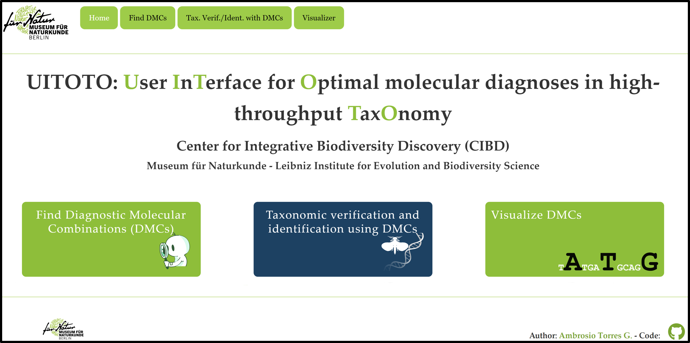

<!-- README.md is generated from README.Rmd. Please edit that file -->

```{r, include = FALSE}
knitr::opts_chunk$set(
  collapse = TRUE,
  comment = "#>",
  fig.path = "man/figures/README-",
  out.width = "100%"
)
```

	```{r, echo=FALSE, fig.cap="", out.width = '50%'}
	knitr::include_graphics("inst/app/www/img/UITOTOprime.png")
	```

<!-- badges: start -->
[)](https://github.com/atorresgalvis/UITOTO)
[](https://doi.org/10.5281/zenodo.11236953)
<!-- badges: end -->

The [**```UITOTO```**](https://github.com/atorresgalvis/UITOTO) [R](https://www.r-project.org/) package addresses the challenges associated with finding, testing, and visualizing reliable Diagnostic Molecular Combinations (DMCs), especially those arising from high-throughput taxonomy. The package also features a user-friendly [Shiny](https://shiny.posit.co/) App that can be accessed [online](https://atorresgalvis.shinyapps.io/MolecularDiagnoses/) or locally in [RStudio](https://posit.co/products/open-source/rstudio/).

## `r emo::ji("toolbox")` Pre-Installation 

You may need to complete a pre-installation process to ensure your environment is configured with the prerequisites required for [**```UITOTO```**](https://github.com/atorresgalvis/UITOTO) installation. The complete list of packages from [CRAN](https://cran.r-project.org/) required by [**```UITOTO```**](https://github.com/atorresgalvis/UITOTO) could be provided by typing in [R](https://www.r-project.org/):
``` {r, eval=F, echo=T}
packages <- c("dplyr", "ggplot2", "readr", "seqinr", "shiny", "shinyjs", "shinyWidgets")
```
Afterward, you can install the packages that have not yet been installed all at once with:
``` {r, eval=F, echo=T}
installed_packages <- packages %in% rownames(installed.packages())
if (any(installed_packages == FALSE)) {
  install.packages(packages[!installed_packages])
}
```
As [**```UITOTO```**](https://github.com/atorresgalvis/UITOTO) uses some packages from [Bioconductor](https://www.bioconductor.org) (Biostrings and DECIPHER), it is highly recommended to follow the instructions included in https://www.bioconductor.org/install/. The BiocManager package is used for managing [Bioconductor](https://www.bioconductor.org) resources, so to get 
it you should use:
``` {r, eval=F, echo=T}
# Updated to 17/04/2024.
if (!require("BiocManager", quietly = TRUE))
    install.packages("BiocManager")
BiocManager::install(version = "3.18")
```
After that, you can install [Biostrings](https://bioconductor.org/packages/release/bioc/html/Biostrings.html):
``` {r, eval=F, echo=T}
BiocManager::install("Biostrings")
```
As well as the [DECIPHER](https://www.bioconductor.org/packages/release/bioc/html/DECIPHER.html) package:
``` {r, eval=F, echo=T}
BiocManager::install("DECIPHER")
```
Now you should be ready to install [**```UITOTO```**](https://github.com/atorresgalvis/UITOTO). However, it is advisable to restart the RStudio session or simply close and reopen the program.

## `r emo::ji("save")` Installation

Now that everything is ready, you have different ways for installing the package.

1. You can install the released version of [**```UITOTO```**](https://github.com/atorresgalvis/UITOTO) from [GitHub](https://github.com/) with:
	
	```{r, eval=FALSE}
	# Install and load devtools (if you don't have it) with the commands:
	# 		install.packages("devtools"); library(devtools)
	devtools::install_github("atorresgalvis/UITOTO")
	```
2. Additionally, you can download the source package (*e.g.*, the compressed folder UITOTO_1.0.0.tar.gz) 
	and install it using mouse-only navigation `r emo::ji("computer_mouse")` in [RStudio](https://posit.co/products/open-source/rstudio/):
	
	```{r, echo=FALSE, fig.cap="Installation of UITOTO using mouse-only navigation in RStudio.", out.width = '100%'}
	
	```
	
Then, you should load the package into your work session:
```{r, eval=FALSE}
library(UITOTO)
```

## `r emo::ji("woman_technologist")` Get Started
- `r emo::ji("man_running")` **Running the [**```UITOTO```**](https://github.com/atorresgalvis/UITOTO)** **Shiny app locally**

	```{r , eval=F, echo=T}
	runUITOTO()
	```

	`r emo::ji("warning")` **IMPORTANT:** By default, users of [Shiny](https://shiny.posit.co/) apps can only upload files up to 5 MB.
	You can increase this limit by setting the \code{shiny.maxRequestSize} option 
	before executing the [**```UITOTO```**](https://github.com/atorresgalvis/UITOTO) shiny app. For example, to allow up to 12 MB use: 
	```{r , eval=F, echo=T}
	options(shiny.maxRequestSize = 12 * 1024^2)
	#And then run the UITOTO shiny app normally
	runUITOTO()
	```
	
	```{r, echo=FALSE, fig.cap="UITOTO Shiny app home page.", out.width = '100%'}
	
	```
	
- `r emo::ji("magnifying_glass_tilted_left")` **Find Diagnostic Molecular Combinations (DMCs)**
	
	You could use the module *Find DMCs* of the	[**```UITOTO```**](https://atorresgalvis.shinyapps.io/MolecularDiagnoses/) 
	Shiny app for identifying reliable DMCs. However, for very time-consuming searches `r emo::ji("hourglass_not_done")`, the command-driven version is 
	strongly recommended. For this, you will need to use the ```OpDMC``` function.
	You will notice that the function includes eight different arguments for configuring searches. 
	However, most of them are provided with default settings, enhancing user-friendliness while also 
	enabling customized DMC searches. The complete syntax of the ```OpDMC``` function is outlined below.
	Information regarding each argument can be found in the [package manual](https://github.com/atorresgalvis/UITOTO/blob/main/UITOTO_1.0.0.pdf), 
	function help documentation (use ```?OpDMC``` in the console), or directly within the 
	[**```UITOTO```**](https://atorresgalvis.shinyapps.io/MolecularDiagnoses/) Shiny app:
	
	```{r , eval=F, echo=T}
	OpDMC("FastaFile.fasta", 
		  "SpeciesList.csv", 
		  iter = 20000, 
		  MnLen = 4, 
		  exclusive = 4, 
		  RefStrength = 0.25, 
		  OutName = "OpDMC_output.csv", 
		  GapsNew = FALSE
	)
	```
	`r emo::ji("look")` Note well that the [**```UITOTO```**](https://atorresgalvis.shinyapps.io/MolecularDiagnoses/) Shiny app can 
	also function as a scripter. This means you don't have to worry about the syntax of the commands; 
	you simply need to drag the files and modify the settings using mouse-only navigation `r emo::ji("computer_mouse")`. 
	The app will then automatically display the equivalent [R](https://www.r-project.org/) commands based 
	on the actions you performed visually:
	
	```{r, echo=FALSE, fig.cap="Module 'Find DMCs' of the UITOTO Shiny app.", out.width = '100%'}
	
	```
	The two mandatory arguments that the user must provide are the names of the input files to be used during the 
	searches. The format and conventions of these input files are quite simple. 
	First, just provide a single-column csv file with the list of entities (*e.g.*, species, genera, OTUs) 
	you wish to diagnose:
	
	```{r , eval=F, echo=T}
	Megaselia_fengae
	Megaselia_oliverleei
	Megaselia_singaporensis
	Megaselia
	```
	
	On the other hand, the ```OpDMC``` function reads each one of the rows of the previous file as a character/string vector
	and selects those sequences from the fasta file that have the string in its header.
	So, it doesn't matter the format of the header of your sequence as long as it contains
	the recognition pattern/string. For example, the fasta file could look like this: 
	
	```{r , eval=F, echo=T}
	>ZRCBDP0359666_Senph04Megaselia_oliverleei_holotype
	-tt-tcgtcatctattgcacatatcggctatgctgttgatttagcaattttctcccttcacttggccggaattttttttattttaggagcagtaaatttttttactacaattattggtatacgctcatcaggaatctcattcgaccgaatgcctttatttgtaaaatacgtaggaattaccgcccttttacttcttttat--------gtattagccggagctatcacaatattattaacagatcgaaattttaatacatcatttttcgaccctgcaggaggaggagatccccttttatatca----------
	>Megaselia_fengae
	tttctcgtcatctattgcacatatcggctatgctgttgatttagcaattttctcccttcacttggccggaattttttttattttaggagcagtaaatttttttactacaattattggtatacgctcatcaggaatctcattcgaccgaatgcctttatttgtaaaatacgtaggaattaccgcccttttacttcttttatcgtattagccggagctatcacaatattattaacagatcgaaattttaatacatcatttttcgaccctgcaggaggaggagatccccttttatatca-----------------	
	>ZRCBDP0364918_LPU09_PU14_Pulau-Ubin_19Apr2018|Megaselia_singaporensis
	cggagctatcacaatattatt---a--attg-g--ta-acg-tc--tca-c-g-aat-ct--tt-atttgtaaaatacg-taggaattaccg-cccttt-tacttcttttatcgtattagccggagctatcacaatattattaacagatcgaaattttaatacatcatttttcgaccctgcaggaggaggagatccccttttatatcaatctattgcacatatcggctatgctgttgatttagcaattttctcccttcacttgatctattgcacatatcggctatgctgttgatttagcaattttctcccttc
	```
	
	That's it! Once you have your input files, you are ready to perform DMC searches using the command-drive version
	or the [**```UITOTO```**](https://atorresgalvis.shinyapps.io/MolecularDiagnoses/) Shiny app.
	
	
- `r emo::ji("dna")` **Identifying unknown --aligned and unaligned-- sequences using DMCs**

	Once you have identified Diagnostic Molecular Combinations (DMCs) using 
	[**```UITOTO```](https://github.com/atorresgalvis/UITOTO)**, 
	you can use these DMCs to identify unknown sequences. This functionality is accessible via 
	the Shiny app Graphical User Interface (GUI) under the module *Taxonomic verification and identification 
	using DMCs* or through the command-line functions: ```Identifier```, ```ALnID```, and 
	```IdentifierU```. 
	
	The ```Identifier``` function is the simplest of the three, designed specifically for aligned sequences. 
	It identifies unknown sequences by matching them against a pool of DMCs provided by the user. 
	Therefore, it requires just two input files: a FASTA file with the unknown sequences and a CSV file containing the DMCs. 
	The input files should be formatted as follows:
	
	```{r , eval=F, echo=T}
	>UnknownSequence1
	aactttatacttcatttttggagcttgagcaggaatagttggtacttcactaagaattataattcgagctgaattagggcacccaggtgctttaattggtgatgatcaaatttataatgtaattgtaactgcacatgcatttattataattttttttatagttataccaattataataggaggatttggaaattgattagtacctttaatattaggagctcctgatatagcctttcctcgaataaataatataagattttgaatattacctccatctttaacactattattggcaagtagtatagtagaaaacggagctggaacaggatgaactgtctatcctccactttcttcaaatattgctcatagtggagcttcggttgatttagcaattttttctctccacttagctggtatctcatctattttaggagctgtaaattttattacaacaattattaatatacgttcatcaggaatcacttttgatcgaatacctttatttgtatgatcagttggaattacagctattttactacttctttctttaccagtattagccggagctattactatacttttaacagatcgaaattttaatactgccttttttgaccctgccggaggaggagatccaattctttatcaacatttattt
	>UnknownSequence2
	aacgttatattttatttttggtgcctgagctggaatagtgggtacttctcttagtatcataattcgagcagaattgggtcaccctggtgcattaattggggacgatcaaatttataatgtaattgttaccgctcatgcatttattataattttctttatagtaataccaattataataggaggatttggaaattgattagtacctttaatactaggagctcctgatatagcttttcctcgaataaataatataagtttttgaatattacccccatctttaactcttttattagccagaagtatagtagaaaatggggctggaacaggatgaactgtttatcctccactttcttctagaatcgcccatagaggagcttctgtagacttagcaattttttctcttcatttagcgggaatttcctcaattttaggagctgttaattttattactactattattaatatacgatcatcaggaattacttttgaccgaatacctttatttgtctgatctgttggaattacagctcttttattacttttatcattaccagtattagctggagcaattactatattattaacagatcgaaattttaacacctcattttttgatccagctggaggaggagaccctattctttatcaacatttattt
	>UnknownSequence3
	aacgttatatttcatttttggagcatgagctggaatagtaggaacatcattaagaattataattcgagccgaattaggacatcctggtgctttaattggtgacgatcaaatttataatgtaattgttactgcacatgctttcattataattttctttatagtaatacctattataatgggaggatttggtaattgacttgtacctttaatattaggagctcctgatatagccttccctcgaataaataatataagtttttgaatattacctccttctttaactcttttattagccagaagtatagtagaaaatggagctgggacaggatgaacagtttacccacctctttcttctagtattgctcatagtggggcatctgtagatttagcaattttctcattacaccttgctggaatttcttcaattttaggagctgtaaattttattactacaattattaatatgcgagcttcaggaattacttttgatcgaatacctttatttgtttgatcagtaggaattacagctttactccttttattatcacttcctgttttagcaggagctattactatacttttaactgatcgaaattttaacacttctttcttcgatccagcaggaggaggagatccaattttatatcaacacttattt
	>UnknownSequence4
	aactttatattttatttttggggcatgagcaggaatagtgggaacttctttaagaataataattcgtgctgaattaagccaccccggtgctttaattggagatgatcaaatttacaatgttattgtcactgcccatgcatttattataattttttttatagttatacctattataataggtggatttggtaattgacttgtccctctaatactaggagcacctgatatagcttttcctcgtataaataatataagtttttgaatacttcctccatccctaacattacttattgcaagaagtatagtagaaaatggggctggtacaggttgaacagtttaccctcccctatcctcaagaattgctcatagtggcgcttctgttgatctagctattttttctcttcatatagcaggaatttcttctattttaggagcagttaattttattacaacaattattaatatacgatcaataggaatcacttttgaccgtatacctttatttgtttgatcagttggtattactgccattctattattactatcattgcctgttttagcaggagctattacaatacttttaacagaccgaaactttaacacttctttttttgatccggccggtggtggagacccaatcttataccaacatttattc
	```
	
	```{r , eval=F, echo=T}
	"","Species","DMC","Alter-DMC"
	"1","Species_1","[58: C, 85: T, 127: G, 247: T, 274: C]","[1: G, 2: C, 127: G, 274: C, 313: T]"
	"2","Species_2","[85: T, 106: G, 118: C, 268: C]","[106: G, 118: C, 169: T, 172: T]"
	"3","Species_3","[92: A, 170: A, 184: A, 208: C, 256: C, 283: G]","[7: A, 62: C, 70: A, 92: A, 185: C, 283: G]"
	```
	
	`r emo::ji("look")` Please note that the DMCs file produced by [**```UITOTO```](https://github.com/atorresgalvis/UITOTO)** 
	(*i.e.*, the output of the ```OpDMC``` function, as detailed in the previous section) includes 
	three columns: "Species," "DMC," and "Alter-DMC." This is because the file provides both the 
	primary/final DMC ("DMC" column) and an alternative DMC ("Alter-DMC" column) for each species. 
	However, the ```Identifier``` function only requires the "Species" and "DMC" columns; 
	making the "Alter-DMC" column optional. Thus, DMC files generated by other software can also 
	be used in [**`UITOTO`**](https://github.com/atorresgalvis/UITOTO) as long as they include 
	the two mandatory columns.


	...`r emo::ji("woman_construction_worker")``r emo::ji("construction")``r emo::ji("man_construction_worker")`

## `r emo::ji("memo")` Citation

- Torres, A., Lee, L., Srivathsan, A., & Meier, R. (2024). UITOTO: User Interface for Optimal Molecular Diagnoses in High-Throughput Taxonomy (v1.0.0). Zenodo. [https://doi.org/10.5281/zenodo.11236953](https://doi.org/10.5281/zenodo.11236953)
