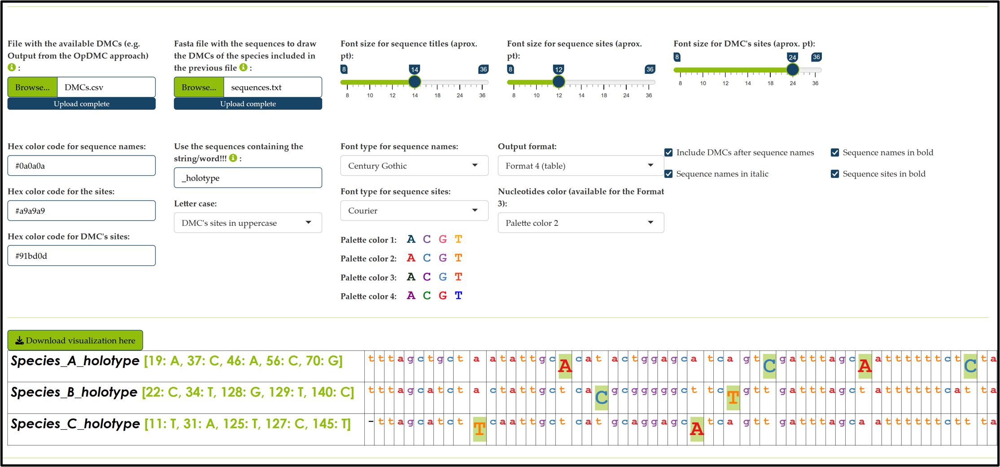

<!-- README.md is generated from README.Rmd. Please edit that file -->

<p align="center">
<a href="https://atorresgalvis.shinyapps.io/MolecularDiagnoses/"></a>
</p>

<!-- badges: start -->
<p align=center>
<a href="https://github.com/atorresgalvis/UITOTO"></a> 
<a href="https://doi.org/10.5281/zenodo.11236953"></a>
</p>
<!-- badges: end -->

<p align=center>
<a href="https://www.museumfuernaturkunde.berlin/en/science/research/dynamics-nature/centre-integrative-biodiversity-discovery"></a>
&emsp;&emsp;
<a href="https://www.museumfuernaturkunde.berlin/"></a>
</p>

The [**`UITOTO`**](https://github.com/atorresgalvis/UITOTO)
[R](https://www.r-project.org/) package addresses the challenges
associated with finding, testing, and visualizing reliable Diagnostic
Molecular Combinations (DMCs), especially those arising from
high-throughput taxonomy. The package also features a user-friendly
[Shiny](https://shiny.posit.co/) App that can be accessed
[online](https://atorresgalvis.shinyapps.io/MolecularDiagnoses/) or
locally in [RStudio](https://posit.co/products/open-source/rstudio/).

## 🧰 Pre-Installation

You may need to complete a pre-installation process to ensure your
environment is configured with the prerequisites required for
[**`UITOTO`**](https://github.com/atorresgalvis/UITOTO) installation.
The complete list of packages from [CRAN](https://cran.r-project.org/)
required by [**`UITOTO`**](https://github.com/atorresgalvis/UITOTO)
could be provided by typing in [R](https://www.r-project.org/):

``` r
packages <- c("dplyr", "ggplot2", "readr", "seqinr", "shiny", "shinyjs", "shinyWidgets")
```

Afterward, you can install the packages that have not yet been installed
all at once with:

``` r
installed_packages <- packages %in% rownames(installed.packages())
if (any(installed_packages == FALSE)) {
  install.packages(packages[!installed_packages])
}
```

As [**`UITOTO`**](https://github.com/atorresgalvis/UITOTO) uses some
packages from [Bioconductor](https://www.bioconductor.org) (Biostrings
and DECIPHER), it is highly recommended to follow the instructions
included in <https://www.bioconductor.org/install/>. The BiocManager
package is used for managing
[Bioconductor](https://www.bioconductor.org) resources, so to get it you
should use:

``` r
# Updated to 24/10/2024.
if (!require("BiocManager", quietly = TRUE))
    install.packages("BiocManager")
BiocManager::install(version = "3.19")
```

After that, you can install
[Biostrings](https://bioconductor.org/packages/release/bioc/html/Biostrings.html):

``` r
BiocManager::install("Biostrings")
```

As well as the
[DECIPHER](https://www.bioconductor.org/packages/release/bioc/html/DECIPHER.html)
package:

``` r
BiocManager::install("DECIPHER")
```

Now you should be ready to install
[**`UITOTO`**](https://github.com/atorresgalvis/UITOTO). However, it is
advisable to restart the RStudio session or simply close and reopen the
program.

## 💾 Installation

Now that everything is ready, you have different ways for installing the
package.

1.  You can install the released version of
  [**`UITOTO`**](https://github.com/atorresgalvis/UITOTO) from
  <a href="https://github.com/"></a> with:

  ``` r
  # Install and load devtools, if you don't have it, with the commands:
  # 		install.packages("devtools"); library(devtools)
  devtools::install_github("atorresgalvis/UITOTO")
  ```

2.  Additionally, you can download the source package (*e.g.*, the
  folder UITOTO_1.0.0.tar.gz) and install it using mouse-only navigation 🖱
  in [RStudio](https://posit.co/products/open-source/rstudio/):

  <div class="figure">
  
  <p class="caption">
  Installation of UITOTO using mouse-only navigation in RStudio.
  </p>
  </div>

Then, you should load the package into your work session:

``` r
library(UITOTO)
```

## 👩‍💻 Get Started

- 🏃‍♂️ **Running the [**`UITOTO`**](https://github.com/atorresgalvis/UITOTO)**
  **Shiny app locally**

  ``` r
  runUITOTO()
  ```

  ⚠️ **IMPORTANT:** By default, users of
  [Shiny](https://shiny.posit.co/) apps can only upload files up to 5
  MB. You can increase this limit by setting the option before executing
  the [**`UITOTO`**](https://github.com/atorresgalvis/UITOTO) shiny app.
  For example, to allow up to 12 MB use:

  ``` r
  options(shiny.maxRequestSize = 12 * 1024^2)
  #And then run the UITOTO shiny app normally
  runUITOTO()
  ```

  <div class="figure">
  
  <p class="caption">
  UITOTO Shiny app home page.
  </p>
  </div>

- 🔍 **Find Diagnostic Molecular Combinations (DMCs)**

  You could use the module *Find DMCs* of the
  [**`UITOTO`**](https://atorresgalvis.shinyapps.io/MolecularDiagnoses/)
  Shiny app for identifying reliable DMCs. However, for very
  time-consuming searches ⏳, the command-driven version is strongly
  recommended. For this, you will need to use the `OpDMC` function.
  You will notice that the function includes eight different arguments for configuring searches. 
	However, most of them are provided with default settings, enhancing user-friendliness while also 
	enabling customized DMC searches. The complete syntax of the ```OpDMC``` function is outlined below.
	Information regarding each argument can be found in the [package manual](https://github.com/atorresgalvis/UITOTO/blob/main/UITOTO_1.0.0.pdf), 
	function help documentation (use `?OpDMC` in the console), or directly within the 
	[**```UITOTO```**](https://atorresgalvis.shinyapps.io/MolecularDiagnoses/) Shiny app:

  ``` r
  OpDMC("FastaFile.fasta", 
        "SpeciesList.csv", 
        iter = 20000, 
        MnLen = 4, 
        exclusive = 4, 
        RefStrength = 0.25, 
        OutName = "OpDMC_output.csv", 
        GapsNew = FALSE
  )
  ```

  👀 Note well that the
  [**`UITOTO`**](https://atorresgalvis.shinyapps.io/MolecularDiagnoses/)
  Shiny app can also function as a scripter. This means you don’t have
  to worry about the syntax of the commands; you simply need to drag the
  files and modify the settings using mouse-only navigation 🖱. The app
  will then automatically display the equivalent
  [R](https://www.r-project.org/) commands based on the actions you
  performed visually:

  <div class="figure">
  
  <p class="caption">
  Module 'Find DMCs' of the UITOTO Shiny app.
  </p>

  The two mandatory arguments that the user must provide are the names of the input files to be used during the 
	searches. The format and conventions of the input files used by
  [**`UITOTO`**](https://github.com/atorresgalvis/UITOTO) are quite
  simple. First, just provide a single-column csv file with the list of
  entities (*e.g.*, species, genera, OTUs) you wish to diagnose:

  ``` r
  Megaselia_fengae
  Megaselia_oliverleei
  Megaselia_singaporensis
  Megaselia
  ```

  On the other hand, the `OpDMC` function reads each one of the rows of the previous file
  as a character/string vector and selects those sequences from the
  fasta file that have the string in its header. So, it doesn’t matter
  the format of the header of your sequence as long as it contains the
  recognition pattern/string. For example, the fasta file could look
  like this::

  ``` r
  >ZRCBDP0359666_Senph04Megaselia_oliverleei_holotype
  -tt-tcgtcatctattgcacatatcggctatgctgttgatttagcaattttctcccttcacttggccggaattttttttattttaggagcagtaaatttttttactacaattattggtatacgctcatcaggaatctcattcgaccgaatgcctttatttgtaaaatacgtaggaattaccgcccttttacttcttttat--------gtattagccggagctatcacaatattattaacagatcgaaattttaatacatcatttttcgaccctgcaggaggaggagatccccttttatatca----------
  >Megaselia_fengae
  tttctcgtcatctattgcacatatcggctatgctgttgatttagcaattttctcccttcacttggccggaattttttttattttaggagcagtaaatttttttactacaattattggtatacgctcatcaggaatctcattcgaccgaatgcctttatttgtaaaatacgtaggaattaccgcccttttacttcttttatcgtattagccggagctatcacaatattattaacagatcgaaattttaatacatcatttttcgaccctgcaggaggaggagatccccttttatatca-----------------   
  >ZRCBDP0364918_LPU09_PU14_Pulau-Ubin_19Apr2018|Megaselia_singaporensis
  cggagctatcacaatattatt---a--attg-g--ta-acg-tc--tca-c-g-aat-ct--tt-atttgtaaaatacg-taggaattaccg-cccttt-tacttcttttatcgtattagccggagctatcacaatattattaacagatcgaaattttaatacatcatttttcgaccctgcaggaggaggagatccccttttatatcaatctattgcacatatcggctatgctgttgatttagcaattttctcccttcacttgatctattgcacatatcggctatgctgttgatttagcaattttctcccttc
  ```
  That's it! Once you have your input files, you are ready to perform DMC searches using the command-drive version or the [**```UITOTO```**](https://atorresgalvis.shinyapps.io/MolecularDiagnoses/) Shiny app.

- 🧬 **Identifying unknown –aligned and unaligned– sequences using DMCs**

    Once you have identified Diagnostic Molecular Combinations (DMCs)
  using [**```UITOTO```**](https://atorresgalvis.shinyapps.io/MolecularDiagnoses/), you
  can use these DMCs to identify unknown sequences. This functionality
  is accessible via the Shiny app Graphical User Interface (GUI) under
  the module *Taxonomic verification and identification using DMCs* or
  through the command-line functions: `Identifier`, `ALnID`, and
  `IdentifierU`.

  The `Identifier` function is the simplest of the three, designed
  specifically for aligned sequences. It identifies unknown sequences by
  matching them against a pool of DMCs provided by the user. Therefore,
  it requires just two input files: a FASTA file with the unknown
  sequences and a CSV file containing the DMCs. The input files should
  be formatted as follows:

  ``` r
  >UnknownSequence1
  aactttatacttcatttttggagcttgagcaggaatagttggtacttcactaagaattataattcgagctgaattagggcacccaggtgctttaattggtgatgatcaaatttataatgtaattgtaactgcacatgcatttattataattttttttatagttataccaattataataggaggatttggaaattgattagtacctttaatattaggagctcctgatatagcctttcctcgaataaataatataagattttgaatattacctccatctttaacactattattggcaagtagtatagtagaaaacggagctggaacaggatgaactgtctatcctccactttcttcaaatattgctcatagtggagcttcggttgatttagcaattttttctctccacttagctggtatctcatctattttaggagctgtaaattttattacaacaattattaatatacgttcatcaggaatcacttttgatcgaatacctttatttgtatgatcagttggaattacagctattttactacttctttctttaccagtattagccggagctattactatacttttaacagatcgaaattttaatactgccttttttgaccctgccggaggaggagatccaattctttatcaacatttattt
  >UnknownSequence2
  aacgttatattttatttttggtgcctgagctggaatagtgggtacttctcttagtatcataattcgagcagaattgggtcaccctggtgcattaattggggacgatcaaatttataatgtaattgttaccgctcatgcatttattataattttctttatagtaataccaattataataggaggatttggaaattgattagtacctttaatactaggagctcctgatatagcttttcctcgaataaataatataagtttttgaatattacccccatctttaactcttttattagccagaagtatagtagaaaatggggctggaacaggatgaactgtttatcctccactttcttctagaatcgcccatagaggagcttctgtagacttagcaattttttctcttcatttagcgggaatttcctcaattttaggagctgttaattttattactactattattaatatacgatcatcaggaattacttttgaccgaatacctttatttgtctgatctgttggaattacagctcttttattacttttatcattaccagtattagctggagcaattactatattattaacagatcgaaattttaacacctcattttttgatccagctggaggaggagaccctattctttatcaacatttattt
  >UnknownSequence3
  aacgttatatttcatttttggagcatgagctggaatagtaggaacatcattaagaattataattcgagccgaattaggacatcctggtgctttaattggtgacgatcaaatttataatgtaattgttactgcacatgctttcattataattttctttatagtaatacctattataatgggaggatttggtaattgacttgtacctttaatattaggagctcctgatatagccttccctcgaataaataatataagtttttgaatattacctccttctttaactcttttattagccagaagtatagtagaaaatggagctgggacaggatgaacagtttacccacctctttcttctagtattgctcatagtggggcatctgtagatttagcaattttctcattacaccttgctggaatttcttcaattttaggagctgtaaattttattactacaattattaatatgcgagcttcaggaattacttttgatcgaatacctttatttgtttgatcagtaggaattacagctttactccttttattatcacttcctgttttagcaggagctattactatacttttaactgatcgaaattttaacacttctttcttcgatccagcaggaggaggagatccaattttatatcaacacttattt
  >UnknownSequence4
  aactttatattttatttttggggcatgagcaggaatagtgggaacttctttaagaataataattcgtgctgaattaagccaccccggtgctttaattggagatgatcaaatttacaatgttattgtcactgcccatgcatttattataattttttttatagttatacctattataataggtggatttggtaattgacttgtccctctaatactaggagcacctgatatagcttttcctcgtataaataatataagtttttgaatacttcctccatccctaacattacttattgcaagaagtatagtagaaaatggggctggtacaggttgaacagtttaccctcccctatcctcaagaattgctcatagtggcgcttctgttgatctagctattttttctcttcatatagcaggaatttcttctattttaggagcagttaattttattacaacaattattaatatacgatcaataggaatcacttttgaccgtatacctttatttgtttgatcagttggtattactgccattctattattactatcattgcctgttttagcaggagctattacaatacttttaacagaccgaaactttaacacttctttttttgatccggccggtggtggagacccaatcttataccaacatttattc
  ```

  ``` r
  "","Species","DMC","Alter-DMC"
  "1","Species_1","[58: C, 85: T, 127: G, 247: T, 274: C]","[1: G, 2: C, 127: G, 274: C, 313: T]"
  "2","Species_2","[85: T, 106: G, 118: C, 268: C]","[106: G, 118: C, 169: T, 172: T]"
  "3","Species_3","[92: A, 170: A, 184: A, 208: C, 256: C, 283: G]","[7: A, 62: C, 70: A, 92: A, 185: C, 283: G]"
  ```

  👀 Please note that the DMCs file produced by
  [**```UITOTO```**](https://atorresgalvis.shinyapps.io/MolecularDiagnoses/) (*i.e.*,
  the output of the `OpDMC` function, as detailed in the previous
  section) includes three columns: “Species,” “DMC,” and “Alter-DMC.”
  This is because the file provides both the primary/final DMC (“DMC”
  column) and an alternative DMC (“Alter-DMC” column) for each species.
  However, the `Identifier` function only requires the “Species” and
  “DMC” columns; making the “Alter-DMC” column optional. Thus, DMC files
  generated by other software can also be used in
  [**```UITOTO```**](https://atorresgalvis.shinyapps.io/MolecularDiagnoses/) as long as
  they include the two mandatory columns.

  Once we have the two mandatory input files, we can run the
  `Identifier` function following its syntax outlined below:

  ``` r
  Identifier(
      DMC_Output = "OpDMC_output.csv",
      dataset = "DatasetAlignedQuery.fas",
      mismatches = 1,
      OutName = "IdentificationOutput.csv",
      MissLogFile = "LogMissing.csv"
  )
  ```

  As we mentioned, both input files are mandatory. However, the
  remaining arguments of the function are optional. The `mismatches`
  argument defines the maximum number of mismatches allowed between the
  DMC and the unknown sequences, with a default value of 1. `OutName`
  allows specifying the name of the output CSV file for the
  identification results (default is “IdentificationOutput.csv”), while
  `MissLogFile` defines the file name for logging comparisons that could
  not be performed due to missing data; setting this to “none” skips
  logging, which is not recommended for alignments with missing or gappy
  regions. Detailed information for each argument can be found in the
  [package
  manual](https://github.com/atorresgalvis/UITOTO/blob/main/UITOTO_1.0.0.pdf),
  or by typing `?Identifier` in the console.

  💡 **Note:** The `ALnID` function operates similarly to the
  `Identifier` function, but first it aligns unaligned unknown sequences
  from a FASTA file with the sequences used to derive the DMCs. This
  function is particularly useful when the unknown sequences are not
  aligned with each other or with the sequences used to derive the DMCs.
  Finally, the `IdentifierU` function employs an alignment-free
  approach, using a dynamic sliding window to iteratively compare
  patterns with the provided DMC patterns.

  📊 **Performance evaluation and cross-validation** 📈  
  In addition to identifying unknown sequences, DMCs can be used to
  evaluate their performance through cross-validation. This involves
  assessing the accuracy and reliability of the DMCs by applying them to
  a separate set of sequences and measuring how well they identify these
  sequences. To conduct this evaluation, you should first split your
  dataset into training and testing datasets. The training dataset is
  then used to derive the DMCs (*e.g.*, by using the `OpDMC` function),
  while the testing dataset is used to assess their performance.
  Although [**`UITOTO`**](https://github.com/atorresgalvis/UITOTO) does
  not include a built-in cross-validation feature or module, you can
  manually split your data and use the `ALnID` or `Identifier` functions
  to evaluate the DMCs. Additionally, you may follow the
  cross-validation pipeline and scripts developed in the
  [**`UITOTO`**](https://github.com/atorresgalvis/UITOTO) software
  article (see citation section below), where metrics commonly used in
  machine learning techniques, such as discriminant analysis and deep
  learning, were employed to evaluate the effectiveness of DMCs as a
  classification tool. This pipeline was also used by Amorin *et al.*,
  (2024).

- 🖍 **Visualizing DMCs** 👩‍🎨🖌

  The “Visualize DMCs” module in
  [**`UITOTO`**](https://github.com/atorresgalvis/UITOTO) is designed to
  assist users in generating detailed, publication-quality
  visualizations of Diagnostic Molecular Combinations (DMCs). This
  module is accessible exclusively via the Shiny app interface and
  offers interactive features that facilitate the comparison and
  interpretation of DMCs across various taxa. Users can customize
  visualizations with options such as color schemes, plot types, and
  annotation features, tailoring the output to meet their specific
  needs. Additionally, the visualizations can be exported in
  high-resolution formats, making them suitable for inclusion in
  scientific publications and presentations.

  To use the module, open the
  [**`UITOTO`**](https://atorresgalvis.shinyapps.io/MolecularDiagnoses/)
  Shiny app and navigate to the “Visualize DMCs” tab. Begin by importing
  your DMC data file, which can be obtained using the `OpDMC` function
  (see above), along with a FASTA file containing the sequences on which
  the DMCs will be illustrated. Ensure that the FASTA file includes at
  least one specimen/sequence for each species represented in the DMC
  file, and that these sequences contain a recognizable string in their
  names; by default, this string is “\_holotype” (*i.e.*, verify that
  the FASTA file includes at least one sequence with this
  recognition-string for each species listed in the DMCs file).

  Once your data is loaded, utilize the interactive tools to create
  plots and tables, customizing the visual appearance to your
  preference. You can then export your visualizations in various formats
  or directly copy and paste them into your manuscripts or
  presentations. Here is an example of a visualization in the
  [**`UITOTO`**](https://atorresgalvis.shinyapps.io/MolecularDiagnoses/)
  Shiny app:

  <div class="figure">

  
  <p class="caption">
  Module ‘Visualize DMCs’ of the UITOTO Shiny app.
  </p>

  </div>


## 📝 Citation and references
- Amorim, D.S., Oliveira, S.S., Balbi, M.I.P.A., Ang, Y., Torres, A.,
  Yeo, D., Srivathsan, A., Meier, R. (2024). An integrative taxonomic
  treatment of the Mycetophilidae (Diptera: Bibionomorpha) from
  Singapore reveals 115 new species on 730 km². *Integrative
  Systematics: Stuttgart Contributions to Natural History*, *in press*.
- Torres, A., Lee, L., Srivathsan, A., & Meier, R. (2024). UITOTO: User Interface for Optimal Molecular Diagnoses in High-Throughput Taxonomy (v1.0.0). Zenodo. [https://doi.org/10.5281/zenodo.11236953](https://doi.org/10.5281/zenodo.11236953)	

